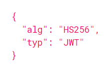
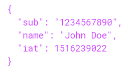
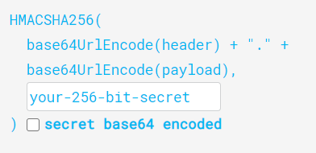

## 1. HTTP 특성

HTTP는 인터넷 상에서 데이터를 주고 받기 위한 서버/클라이언트 모델을 따르는 프로토콜입니다. 클라이언트가 서버에게 요청을 보내면 서버는 응답을 보냄으로써, 데이터를 교환합니다. HTTP는 **비연결성** 및 **무상태성** 이라는 특징을 가지고 있습니다. HTTP는 요청에 대한 응답을 처리하게 되면 연결을 끊어 버립니다. 따라서 클라이언트에 대한 이전의 상태 정보 및 현재 통신의 상태가 남아있지 않습니다.

서버가 다수의 클라이언트와 연결을 계속 유지한다면, 이에 따른 자원 낭비가 심해집니다. 비연결성 및 무상태성의 특징을 가진다면 불필요한 자원 낭비를 줄일 수 있다는 장점이 있습니다.

그러나 서버는 클라이언트를 식별할 수 없다는 단점 또한 존재합니다. 로그인을 하더라도 다음 요청에서는 해당 클라이언트를 기억하지 못해, 또 로그인을 해야하는 문제가 발생합니다. 브라우저에서 새로고침을 누를 때마다 로그인을 해야하는 상황, 상상이 되시나요? 😱😱

하지만 우리가 사용하고 있는 웹 사이트들의 경우, 한 번 로그인 하면 다시 로그인할 필요 없이 여러 페이지를 돌아다니며 다양한 기능들을 이용할 수 있습니다. 심지어는 브라우저를 껐다 켜도 로그인이 유지가 되기도 하지요. 이는 HTTP의 비연결성 및 무상태성 특징을 보완한 기술인 Cookie와 Session 덕분입니다.

<br>

## 2. Cookie

쿠키란 클라이언트가 어떠한 웹사이트를 방문할 경우, 그 사이트가 사용하고 있는 서버를 통해 클라이언트의 브라우저에 설치되는 작은 기록 정보 파일을 일컫습니다.

```
MockHttpServletResponse:
           Status = 200
          Headers = [Set-Cookie:"userName=kevin", "password=abc123"]
```

* 서버는 클라이언트의 로그인 요청에 대한 응답을 작성할 때, 클라이언트 측에 저장하고 싶은 정보를 응답 헤더의 ``Set-Cookie``에 담습니다.
  * 쿠키는 Key-Value 형식의 문자열입니다.

```
MockHttpServletRequest:
      HTTP Method = GET
      Request URI = /user/my/edit
          Headers = [Cookie:"userName=kevin"; "password=abc123"]
```

* 이후 해당 클라이언트는 요청을 보낼 때마다, 매번 저장된 쿠키를 요청 헤더의 ``Cookie``에 담아 보냅니다.
* 서버는 쿠키에 담긴 정보를 바탕으로 해당 요청의 클라이언트가 누군지 식별할 수 있습니다.

### 2.1. 단점

* 보안에 취약합니다.
  * 요청 시 쿠키의 값을 그대로 보냅니다.
  * 유출 및 조작 당할 위험이 존재합니다.
* 쿠키에는 용량 제한이 있어 많은 정보를 담을 수 없습니다.
* 웹 브라우저마다 쿠키에 대한 지원 형태가 다르기 때문에 브라우저간 공유가 불가능합니다.
* 쿠키의 사이즈가 커질수록 네트워크에 부하가 심해집니다.

<br>

## 3. Cookie & Session 기반 인증

쿠키를 통해 클라이언트 로그인 상태를 유지시킬 수 있었지만, 가장 큰 단점은 쿠키가 유출 및 조작 당할 위험이 존재한다는 것입니다. 개인정보를 HTTP로 주고 받는 것은 위험합니다.

세션은 비밀번호 등 클라이언트의 인증 정보를 쿠키가 아닌 서버 측에 저장하고 관리합니다.

```
HTTP/1.1 200
Set-Cookie: JSESSIONID=FDB5E30BF20045E8A9AAFC788383680C;
```

* 서버는 클라이언트의 로그인 요청에 대한 응답을 작성할 때, 인증 정보는 서버에 저장하고 클라이언트 식별자인 JSESSIONID를 쿠키에 담습니다.
* 이후 클라이언트는 요청을 보낼 때마다, JSESSIONID 쿠키를 함께 보냅니다.
* 서버는 JSESSIONID 유효성을 판별해 클라이언트를 식별합니다.

### 3.1. 장단점

* 쿠키를 포함한 요청이 외부에 노출되더라도 세션 ID 자체는 유의미한 개인정보를 담고 있지 않습니다.
  * 그러나 해커가 이를 중간에 탈취하여 클라이언트인척 위장할 수 있다는 한계가 존재합니다.
* 각 사용자마다 고유한 세션 ID가 발급되기 때문에, 요청이 들어올 때마다 회원정보를 확인할 필요가 없습니다.
* 서버에서 세션 저장소를 사용하므로 요청이 많아지면 서버에 부하가 심해집니다.

<br>

## 4. JWT 기반 인증

JWT(JSON Web Token)란 인증에 필요한 정보들을 암호화시킨 토큰을 의미합니다. JWT 기반 인증은 쿠키/세션 방식과 유사하게 JWT 토큰(Access Token)을 HTTP 헤더에 실어 서버가 클라이언트를 식별합니다.

### 4.1. JWT 구조


JWT는 .을 구분자로 나누어지는 세 가지 문자열의 조합입니다. 실제 디코딩된 JWT는 다음과 같은 구조를 지닙니다.

#### Header



Header는 alg과 typ는 각각 정보를 암호화할 해싱 알고리즘 및 토큰의 타입을 지정합니다.

#### Payload



Payload는 토큰에 담을 정보를 지니고 있습니다. 주로 클라이언트의 고유 ID 값 및 유효 기간 등이 포함되는 영역입니다. key-value 형식으로 이루어진 한 쌍의 정보를 Claim이라고 칭합니다.

#### Signature



Signature는 인코딩된 Header와 Payload를 더한 뒤 비밀키로 해싱하여 생성합니다. Header와 Payload는 단순히 인코딩된 값이기 때문에 제 3자가 복호화 및 조작할 수 있지만, Signature는 서버 측에서 관리하는 비밀키가 유출되지 않는 이상 복호화할 수 없습니다. 따라서 Signature는 토큰의 위변조 여부를 확인하는데 사용됩니다.

### 4.2. 인증 과정

```
{
	Authorization: <type> <access-token>
}
```

1. 클라이언트 로그인 요청이 들어오면, 서버는 검증 후 클라이언트 고유 ID 등의 정보를 Payload에 담습니다.
2. 암호화할 비밀키를 사용해 Access Token(JWT)을 발급합니다.
3. 클라이언트는 전달받은 토큰을 저장해두고, 서버에 요청할 때 마다 토큰을 요청 헤더 ``Authorization``에 포함시켜 함께 전달합니다.
4. 서버는 토큰의 Signature를 비밀키로 복호화한 다음, 위변조 여부 및 유효 기간 등을 확인합니다.
5. 유효한 토큰이라면 요청에 응답합니다.

### 4.3. 장점

1. Header와 Payload를 가지고 Signature를 생성하므로 데이터 위변조를 막을 수 있습니다.
2. 인증 정보에 대한 별도의 저장소가 필요없습니다.
  * JWT는 토큰에 대한 기본 정보와 전달할 정보 및 토큰이 검증됬음을 증명하는 서명 등 필요한 모든 정보를 자체적으로 지니고 있습니다.
  * 클라이언트 인증 정보를 저장하는 세션과 다르게, 서버는 무상태가 됩니다.
3. 확장성이 우수합니다.
  * 토큰 기반으로 다른 로그인 시스템에 접근 및 권한 공유가 가능합니다.
  * OAuth의 경우 Facebook, Google 등 소셜 계정을 이용하여 다른 웹서비스에서도 로그인을 할 수 있습니다.
4. 모바일 어플리케이션 환경에서도 잘 동작합니다.

### 4.4. 단점

1. 쿠키/세션과 다르게 JWT는 토큰의 길이가 길어, 인증 요청이 많아질수록 서버의 부하가 심해집니다.
2. Payload 자체는 암호화되지 않기 때문에 유저의 중요한 정보는 담을 수 없습니다.
3. 토큰을 탈취당하면 대처하기 어렵습니다.
  * 토큰은 한 번 발급되면 유효기간이 만료될 때 까지 계속 사용이 가능하기 때문입니다.
  * 특정 사용자의 접속을 강제로 만료하기 어렵지만, 쿠키/세션 기반 인증은 서버 쪽에서 쉽게 세션을 삭제할 수 있습니다.

<br>

## 5. 보안 전략

JWT 사용시 상기한 단점들을 극복하기 위해 다양한 전략을 채택할 수 있습니다. 각각의 전략은 장단점이 상이하기 때문에, 서비스의 특성을 고려하여 보안 수준을 높일지 사용자의 편의성을 높일지 결정해야 합니다.

### 5.1. 짧은 만료 기한 설정

토큰의 만료 시간을 짧게 설정하는 방법을 고려할 수 있습니다. 토큰이 탈취되더라도 빠르게 만료되기 때문에 피해를 최소화할 수 있습니다. 그러나 사용자가 자주 로그인해야 하는 불편함이 수반됩니다.

### 5.2. Sliding Session

글을 작성하는 도중 토큰이 만료가 된다면 Form Submit 요청을 보낼 때 작업이 정상적으로 처리되지 않고, 이전에 작성한 글이 날아가는 등의 불편함이 존재합니다. Sliding Session은 서비스를 지속적으로 이용하는 클라이언트에게 자동으로 토큰 만료 기한을 늘려주는 방법입니다. 글 작성 혹은 결제 등을 시작할 때 새로운 토큰을 발급해줄 수 있습니다. 이를 통해 사용자는 로그인을 자주 할 필요가 없어집니다.

### 5.3. Refresh Token

클라이언트가 로그인 요청을 보내면 서버는 Access Token 및 그보다 긴 만료 기간을 가진 Refresh Token을 발급하는 전략입니다. 클라이언트는 Access Token이 만료되었을 때 Refresh Token을 사용하여 Access Token의 재발급을 요청합니다. 서버는 DB에 저장된 Refresh Token과 비교하여 유효한 경우 새로운 Access Token을 발급하고, 만료된 경우 사용자에게 로그인을 요구합니다.

해당 전략을 사용하면 Access Token의 만료 기한을 짧게 설정할 수 있으며, 사용자가 자주 로그인할 필요가 없습니다. 또한 서버가 강제로 Refresh Token을 만료시킬 수 있습니다.

그러나 검증을 위해 서버는 Refresh Token을 별도의 storage에 저장해야 합니다. 이는 추가적인 I/O 작업이 발생함을 의미하기 때문에 JWT의 장점(I/O 작업이 필요 없는 빠른 인증 처리)을 완벽하게 누릴 수 없습니다. 클라이언트도 탈취 방지를 위해 Refresh Token을 보안이 유지되는 공간에 저장해야 합니다.

<br>

---

## Reference

* [JWT 장점과 단점](http://www.opennaru.com/opennaru-blog/jwt-json-web-token/)
* [서버 인증 (세션/쿠키 기반)](https://brownbears.tistory.com/439)
* [쿠키(Cookie)와 세션(Session) & 로그인 동작 방법](https://cjh5414.github.io/cookie-and-session/)
* [jwt.io](https://jwt.io/)
* [서버 인증 유형](https://velog.io/@djaxornwkd12/%EC%84%9C%EB%B2%84%EC%9D%B8%EC%A6%9D)
* [[JWT] 토큰 기반 인증이란](https://velog.io/@dnjscksdn98/JWT-%ED%86%A0%ED%81%B0-%EA%B8%B0%EB%B0%98-%EC%9D%B8%EC%A6%9D%EC%9D%B4%EB%9E%80)
* [토근 기반 인증에서 bearer는 무엇일까?](https://velog.io/@cada/%ED%86%A0%EA%B7%BC-%EA%B8%B0%EB%B0%98-%EC%9D%B8%EC%A6%9D%EC%97%90%EC%84%9C-bearer%EB%8A%94-%EB%AC%B4%EC%97%87%EC%9D%BC%EA%B9%8C)
* [Refresh Token과 Sliding Sessions를 활용한 JWT의 보안 전략](https://blog.ull.im/engineering/2019/02/07/jwt-strategy.html)
